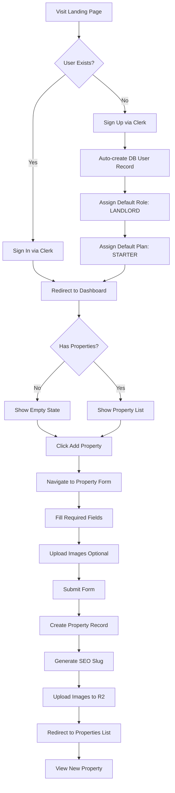
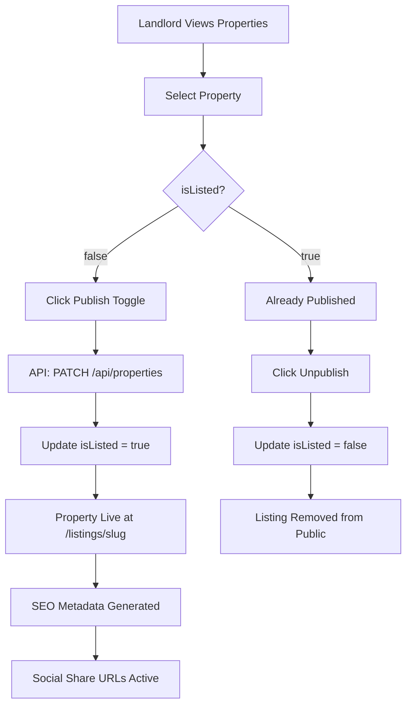
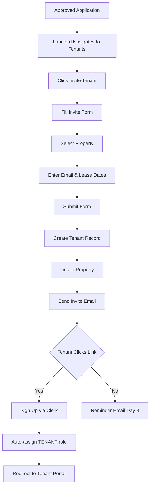
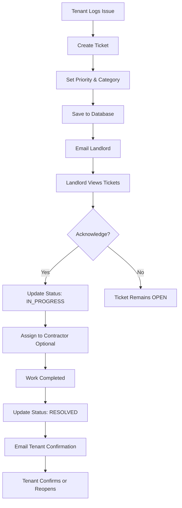
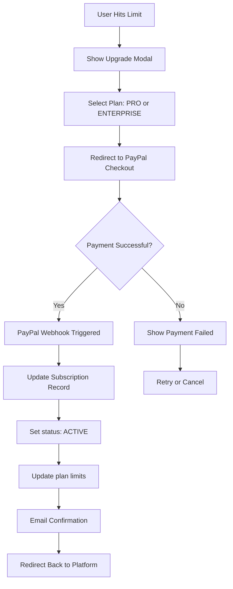

# AutoLandlord - Complete Business Process & Flow Documentation

**Document Version**: 2.0  
**Last Updated**: December 7, 2025  
**Prepared By**: Software Solution Architecture Team  
**Status**: Updated with actual Hono/Drizzle implementation

---

## Table of Contents

1. [Executive Summary](#executive-summary)
2. [System Overview](#system-overview)
3. [Complete Business Flows](#complete-business-flows)
4. [Current Implementation Status](#current-implementation-status)
5. [Future Development Roadmap](#future-development-roadmap)
6. [Technical Architecture](#technical-architecture)
7. [Integration Points](#integration-points)

---

## Executive Summary

**AutoLandlord** is a comprehensive property management SaaS platform designed to streamline landlord-tenant relationships, automate administrative tasks, and provide a centralized hub for property management operations.

### Current State

- **Development Progress**: ~65% Complete (Infrastructure + Core Features)
- **Deployment Status**: Development environment fully operational
- **Infrastructure**: Cloudflare Workers + D1 + R2 + KV (all configured)
- **Tech Stack**: Hono API + Drizzle ORM + React + Next.js
- **Core Features**: Operational with full CRUD capabilities
- **Revenue Model**: Subscription-based (plans seeded, enforcement pending)

### Key Capabilities (Implemented)

✅ Multi-property management (Full CRUD with Drizzle ORM)  
✅ Tenant relationship management (Complete implementation)  
✅ Maintenance ticket tracking (Full system)  
✅ Application processing system (API ready, needs frontend completion)  
✅ Cloudflare R2 file storage (Upload endpoint working)  
✅ Database with 13 tables (migrated & seeded)  
✅ Authentication & user sync (Clerk + auto DB creation)  
✅ Rate limiting (KV-based)  
✅ Error handling & monitoring  
✅ Request tracing  
✅ Health checks

### Pending Features (Roadmap)

⚠️ **Tech Debt (18 items - see TASK_LIST.md)**:

- Enhanced user sync with Clerk API
- Input sanitization & upload security
- Pagination & image optimization
- Frontend validation

⏳ **Business Features**:

- PayPal subscription payments & enforcement
- Tenant self-service portal
- Super admin dashboard
- Document management system
- Automated rent collection
- Public property listings (landing page connection)

---

## System Overview

### Platform Purpose

AutoLandlord serves three primary user personas:

1. **Landlords** (Primary Users)
   - Manage multiple properties
   - Track maintenance requests
   - Process tenant applications
   - Monitor lease agreements
   - Generate marketing materials

2. **Tenants** (Secondary Users)
   - View lease information
   - Submit maintenance requests
   - Access property documents
   - Communicate with landlords

3. **Super Administrators** (Platform Operators)
   - Manage user subscriptions
   - Monitor system health
   - Configure platform settings
   - Handle escalations

### Core Value Propositions

| User Type | Pain Point                | Solution                           |
| --------- | ------------------------- | ---------------------------------- |
| Landlords | Property marketing        | Automated public listings with SEO |
| Landlords | Paper-based processes     | Digital application system         |
| Landlords | Communication overhead    | Centralized ticket management      |
| Tenants   | Slow maintenance response | Real-time ticket tracking          |
| Tenants   | Unclear lease terms       | Self-service lease portal          |

---

## Complete Business Flows

### Flow 1: Landlord Onboarding & First Property Setup

**Trigger**: New user visits platform  
**Goal**: User successfully lists their first property  
**Duration**: 5-10 minutes  
**Status**: ✅ 100% Implemented (Full CRUD Available)

**Property CRUD Features** (December 2025 Update):

- ✅ View Properties List - Grid view with loading skeletons
- ✅ View Property Details - Slide-in sidebar with complete information
- ✅ Create New Property - Form with validation, image upload to R2
- ✅ Edit Property - Pre-filled form with all fields editable
- ✅ Delete Property - Confirmation dialog with proper cleanup
- ✅ Image Upload - Drag-and-drop, preview, automatic compression
- ✅ Form Validation - react-hook-form + Zod schema validation

#### Process Steps



#### Detailed Walkthrough

**Step 1: Landing Page** (`/`)

- **UI Elements**: Hero section, feature highlights, pricing tiers, CTA buttons
- **Actions**: "Sign Up" or "Sign In" buttons
- **Backend**: Static page, no API calls

**Step 2: Authentication** (`/sign-up` or `/sign-in`)

- **Provider**: Clerk
- **Process**:
  1. User completes OAuth (Google/GitHub) or email/password
  2. Clerk creates user session and returns token
  3. User redirected to admin dashboard
  4. First API call triggers auth middleware
  5. `ensureUserExists()` creates DB record if needed:
     - Checks `users` table for Clerk user ID
     - If not found, inserts user with email from Clerk token
     - Creates default `subscription` linked to Starter plan
  6. Auto-assigns role: `LANDLORD`
  7. Dashboard loads with user's data
- **Database Operations** (Drizzle ORM):

  ```typescript
  // apps/auto-landlord-api/src/lib/user-sync.ts
  const [newUser] = await db
    .insert(users)
    .values({
      id: clerkUserId, // Clerk user ID (not UUID)
      email: email,
      name: name || null,
      role: "LANDLORD",
    })
    .returning();

  await db.insert(subscriptions).values({
    userId: newUser.id,
    planId: starterPlan.id, // From plans table
    status: "active",
  });
  ```

**Step 3: Dashboard First View** (`/dashboard`)

- **Conditional Rendering**:
  - If `properties.length === 0` → Empty state with "Add Your First Property" CTA
  - If `properties.length > 0` → Grid view of properties
- **Stats Displayed**: Total Properties, Vacant Units, Open Tickets
- **Data Fetching** (Hono API + Drizzle):

  ```typescript
  // API Endpoint: GET /api/properties
  // apps/auto-landlord-api/src/features/properties/index.ts
  const userId = getUserId(c); // From auth middleware
  const properties = await db.query.properties.findMany({
    where: eq(properties.landlordId, userId),
    with: {
      images: true,
    },
  });

  // Stats calculated in frontend
  const stats = {
    total: properties.length,
    vacant: properties.filter((p) => p.status === "VACANT").length,
    // Tickets fetched separately from /api/tickets
  };
  ```

**Step 4: Property Creation** (`/dashboard/properties/new`)

- **Form Fields**:
  - **Required**: Address, City, State, Zip, Rent Amount
  - **Optional**: Bedrooms, Bathrooms, Property Type, Description
  - **Images**: Up to 10 photos (max 1.5MB each)
- **Client-side Validation**: HTML5 `required` attributes
- **Image Upload Flow**:
  1. User selects images
  2. Preview thumbnails displayed
  3. If any > 1.5MB → Show compression modal
  4. User confirms → Images compressed via Sharp
  5. Uploaded to Cloudflare R2
  6. URLs saved to `PropertyImage` table
- **Backend Operations**:
  1. Create property record
  2. Generate slug: `address-city-state` (lowercased, URL-safe)
  3. Set initial status: `VACANT`
  4. Set `isListed`: `false` (manual publish required)
  5. Revalidate `/dashboard/properties` cache
  6. Redirect to properties list

**Step 5: View Property** (`/dashboard/properties`)

- **Display**: Property cards with address, rent, status badge
- **Actions**: Edit, Delete, Publish/Unpublish toggle (✅ Implemented)
- **Filtering**: All properties for logged-in landlord only

#### Business Rules

| Rule                           | Implementation                                      |
| ------------------------------ | --------------------------------------------------- |
| User must be authenticated     | Middleware enforces on `/dashboard/*` routes        |
| Email must be unique           | Clerk handles, DB has unique constraint             |
| Slug must be unique            | Server-side validation, append counter if duplicate |
| Starter plan: 2 properties max | ⚠️ NOT ENFORCED YET (Phase 5)                       |
| Images must be <50MB total     | R2 enforces, client warns at 1.5MB                  |

#### Error Handling

```typescript
// Property creation failure scenarios
try {
  await prisma.property.create({ ... });
} catch (error) {
  if (error.code === 'P2002') {
    // Unique constraint violation (slug exists)
    return { error: 'A property with this address already exists' };
  }
  if (error.code === 'P2003') {
    // Foreign key violation (invalid landlordId)
    return { error: 'Invalid user session. Please sign in again.' };
  }
  // Generic error
  return { error: 'Failed to create property. Please try again.' };
}
```

---

### Flow 2: Publishing & Marketing Property Listings

**Trigger**: Landlord wants to advertise a property  
**Goal**: Property is publicly accessible with applicant tracking  
**Duration**: 2-3 minutes  
**Status**: ✅ 100% Implemented

#### Process Steps



#### Detailed Walkthrough

**Step 1: Toggle Publish Status**

- **Location**: `/dashboard/properties` page
- **UI Component**: Toggle switch on each property card
- **API Endpoint**: `PATCH /api/properties`
- **Request Body**:
  ```json
  {
    "propertyId": "clx123abc",
    "isListed": true
  }
  ```
- **Backend Logic**:

  ```typescript
  // Verify ownership
  const property = await prisma.property.findFirst({
    where: { id: propertyId, landlordId: user.id },
  });
  if (!property) throw new Error("Unauthorized");

  // Update status
  await prisma.property.update({
    where: { id: propertyId },
    data: { isListed },
  });

  // Revalidate public listing cache
  revalidatePath(`/listings/${property.slug}`);
  ```

**Step 2: Public Listing Page** (`/listings/[slug]`)

- **Access Control**: Public (no auth required)
- **SEO Features**:
  - Dynamic `<title>`: "{address} - ${rentAmount}/mo | AutoLandlord"
  - Meta description: Truncated property description
  - OpenGraph tags for social sharing
  - Schema.org structured data for search engines
- **Page Sections**:
  1. **Hero**: Hero image (first uploaded photo) with overlay text
  2. **Details Card**: Address, rent, bedrooms, bathrooms, property type
  3. **Description**: Full property description
  4. **Image Gallery**: Lightbox view of all photos
  5. **Application Form**: Embedded prospective tenant form
- **Data Fetching**:
  ```typescript
  const property = await prisma.property.findUnique({
    where: { slug: params.slug, isListed: true },
    include: {
      images: { orderBy: { order: "asc" } },
      landlord: { select: { name: true, email: true } },
    },
  });
  if (!property) notFound(); // 404 if not found or not listed
  ```

**Step 3: Application Submission**

- **Form Fields**: Name, Email, Phone (optional), Message
- **Submit Action**: POST to `/api/applications`
- **Backend Process**:
  1. Validate required fields
  2. Create `Application` record with status: `NEW`
  3. Fetch landlord email from property relation
  4. Send application notification email via Resend
  5. Redirect applicant to `/listings/application-submitted success page

**Step 4: Landlord Views Applications** (`/dashboard/applications`)

- **Display**: List of all applications for landlord's properties
- **Columns**: Applicant name, email, property address, status, date submitted
- **Actions**: Mark as viewed, change status (NEW → CONTACTED → APPROVED/REJECTED)
- **Filtering**: By property, by status
- **Data Fetching**:
  ```typescript
  const applications = await prisma.application.findMany({
    where: { property: { landlordId: user.id } },
    include: { property: { select: { address: true } } },
    orderBy: { createdAt: "desc" },
  });
  ```

#### Business Rules

| Rule                                              | Implementation                      |
| ------------------------------------------------- | ----------------------------------- |
| Only published properties appear in `/listings/*` | WHERE clause: `isListed = true`     |
| Landlord can unpublish anytime                    | No restrictions, instant effect     |
| Applications stored even if property unpublished  | Application records persist         |
| Email notifications sent immediately              | Background job via Resend API       |
| Applicant data is never deleted                   | Compliance with data retention laws |

---

### Flow 3: Tenant Management & Lease Tracking

**Trigger**: Landlord approves an application  
**Goal**: Tenant is onboarded with lease details  
**Duration**: 5 minutes  
**Status**: ⚠️ 70% Implemented (Invite email not functional)

#### Process Steps



#### Implementation Details

**Current Status**: ✅ Tenant list view, ✅ Invite form UI, ❌ Invite submission logic

**Step 1: View Tenants** (`/dashboard/tenants`)

- **Display**: Table with tenant name, property address, lease start/end dates
- **Actions**: "Invite New Tenant" button, "Resend Invite" (if not yet signed up)
- **Data Fetching**:
  ```typescript
  const tenants = await prisma.tenant.findMany({
    where: { property: { landlordId: user.id } },
    include: {
      property: { select: { address: true } },
      user: { select: { name: true, email: true } },
    },
  });
  ```

**Step 2: Invite Tenant** (`/dashboard/tenants/invite`)

- **Form Fields**:
  - Email (required)
  - Property dropdown (populated from landlord's properties)
  - Lease start date (required)
  - Lease end date (required)
  - Monthly rent (auto-filled from property, editable)
- **Missing Implementation**:

  ```typescript
  // ❌ TODO: Create this Server Action
  export async function inviteTenant(formData: FormData) {
    const email = formData.get("email") as string;
    const propertyId = formData.get("propertyId") as string;
    const leaseStart = new Date(formData.get("leaseStart") as string);
    const leaseEnd = new Date(formData.get("leaseEnd") as string);

    // Verify property ownership
    const property = await prisma.property.findFirst({
      where: { id: propertyId, landlordId: user.id },
    });
    if (!property) throw new Error("Unauthorized");

    // Create tenant record (user created later on sign-up)
    const tenant = await prisma.tenant.create({
      data: {
        email,
        propertyId,
        leaseStart,
        leaseEnd,
        status: "INVITED",
      },
    });

    // Send invite email
    await sendEmail({
      to: email,
      subject: "You've been invitedto AutoLandlord",
      html: `<a href="${process.env.NEXT_PUBLIC_APP_URL}/sign-up?tenant=${tenant.id}">Accept Invitation</a>`,
    });

    revalidatePath("/dashboard/tenants");
    redirect("/dashboard/tenants");
  }
  ```

**Step 3: Tenant Accepts Invite**

- **Flow**:
  1. Tenant clicks email link with `?tenant=xyz` query param
  2. Redirected to sign-up page
  3. After Clerk authentication, server action:
     - Finds tenant record by ID
     - Associates `userId` with tenant record
     - Updates tenant status: `INVITED` → `ACTIVE`
     - Assigns user role: `TENANT`
  4. Tenant redirected to `/tenant-portal` (Phase 7)

---

### Flow 4: Maintenance Ticket Lifecycle

**Trigger**: Tenant reports a maintenance issue  
**Goal**: Issue is tracked, assigned, and resolved  
**Duration**: Ongoing (days to weeks)  
**Status**: ✅ 90% Implemented (Tenant submission not available yet)

#### Process Steps



#### Implementation Details

**Step 1: Ticket Creation** (Future: `/tenant-portal/tickets/new`)

- **Current Workaround**: Manual DB insert or Landlord creates on behalf
- **Form Fields**:
  - Title (required)
  - Description (required, textarea)
  - Priority (dropdown: LOW | MEDIUM | HIGH | URGENT)
  - Category (optional: Plumbing, Electrical, HVAC, etc.)
  - Attachments (optional, up to 3 images)
- **Backend Logic**:

  ```typescript
  export async function createTicket(formData: FormData) {
    const user = await getOrCreateUser();

    // Verify user is a tenant
    const tenant = await prisma.tenant.findUnique({
      where: { userId: user.id },
    });
    if (!tenant) throw new Error("Only tenants can create tickets");

    const ticket = await prisma.ticket.create({
      data: {
        title: formData.get("title") as string,
        description: formData.get("description") as string,
        priority: formData.get("priority") as string,
        status: "OPEN",
        propertyId: tenant.propertyId,
        creatorId: user.id,
      },
    });

    // Notify landlord
    const property = await prisma.property.findUnique({
      where: { id: tenant.propertyId },
      include: { landlord: true },
    });

    await sendEmail({
      to: property.landlord.email,
      subject: `New Maintenance Request: ${ticket.title}`,
      html: `Tenant reported: ${ticket.description}`,
    });

    revalidatePath("/dashboard/tickets");
  }
  ```

**Step 2: Landlord Views Tickets** (`/dashboard/tickets`)

- **Display**: List view with priority badges, status indicators
- **Filtering**: By status (OPEN, IN_PROGRESS, RESOLVED), by property
- **Actions**: Click to view details, update status dropdown
- **Data Fetching**:
  ```typescript
  const tickets = await prisma.ticket.findMany({
    where: { property: { landlordId: user.id } },
    include: {
      property: { select: { address: true } },
      creator: { select: { name: true } },
    },
    orderBy: [
      { priority: "desc" }, // URGENT first
      { createdAt: "desc" },
    ],
  });
  ```

**Step 3: Ticket Detail View** (`/dashboard/tickets/[id]`)

- **Sections**:
  1. Ticket info (title, description, priority)
  2. Property details
  3. Tenant info
  4. Status history (timestamps for each status change)
  5. Comments/updates (future feature)
  6. Attachment gallery
- **Actions**:
  - Update status dropdown (OPEN → IN_PROGRESS → RESOLVED)
  - Add internal notes
  - Upload resolution photos
  - Mark as closed

**Step 4: Status Update**

- **API Endpoint**: `POST /api/tickets/update-status`
- **Request Body**:
  ```json
  {
    "ticketId": "clx456def",
    "status": "IN_PROGRESS"
  }
  ```
- **Backend Logic**:

  ```typescript
  // Verify ownership
  const ticket = await prisma.ticket.findFirst({
    where: {
      id: ticketId,
      property: { landlordId: user.id }
    }
  });
  if (!ticket) throw new Error('Unauthorized');

  // Update status
  await prisma.ticket.update({
    where: { id: ticketId },
    data: { status, updatedAt: new Date() }
  });

  // Optional: Notify tenant of status change
  if (status === 'RESOLVED') {
    await sendEmail({ ... });
  }
  ```

#### Business Rules

| Rule                             | Implementation                |
| -------------------------------- | ----------------------------- |
| Only tenants can create tickets  | Role check in Server Action   |
| Only landlords can update status | Ownership verification in API |
| URGENT tickets highlighted       | CSS class based on priority   |
| Status transitions validated     | (Future: state machine)       |
| RESOLVED tickets can be reopened | Status change to OPEN allowed |

---

###Flow 5: Subscription & Payment Processing

**Trigger**: User hits plan limits or wants to upgrade  
**Goal**: User subscribes to a paid plan  
**Duration**: 3-5 minutes  
**Status**: ⏳ 0% Implemented (Phase 5)

#### Planned Process Steps



#### Future Implementation Plan

**Step 1: Plan Selection UI** (`/dashboard/settings` → Upgrade button)

- **Display**: Pricing cards (Starter free, Pro $29/mo, Enterprise $99/mo)
- **Features Comparison**:
  - Starter: 2 properties, 5 tenants
  - Pro: 10 properties, unlimited tenants
  - Enterprise: Unlimited properties, priority support
- **CTA**: "Upgrade to Pro" button

**Step 2: PayPal Integration**

- **SDK**: `@paypal/react-paypal-js`
- **Flow**:
  1. User clicks "Upgrade"
  2. Frontend creates PayPal subscription via API
  3. User completes payment on PayPal
  4. PayPal redirects back with subscription ID
  5. Server validates subscription

**Step 3: Webhook Handler** (`/api/webhooks/paypal`)

- **Events to Handle**:
  - `BILLING.SUBSCRIPTION.ACTIVATED` → Set subscription active
  - `BILLING.SUBSCRIPTION.CANCELLED` → Downgrade to free
  - `BILLING.SUBSCRIPTION.SUSPENDED` → Lock account
  - `PAYMENT.SALE.COMPLETED` → Update payment history
- **Implementation**:

  ```typescript
  export async function POST(request: Request) {
    const event = await request.json();

    // Verify webhook signature
    const isValid = verifyPayPalSignature(request.headers, event);
    if (!isValid)
      return NextResponse.json({ error: "Invalid signature" }, { status: 401 });

    switch (event.event_type) {
      case "BILLING.SUBSCRIPTION.ACTIVATED":
        await prisma.subscription.update({
          where: { paypalSubscriptionId: event.resource.id },
          data: {
            status: "ACTIVE",
            currentPeriodEnd: new Date(
              event.resource.billing_info.next_billing_time
            ),
          },
        });
        break;
      // ... handle other events
    }

    return NextResponse.json({ received: true });
  }
  ```

**Step 4: Feature Gating**

- **Property Creation Limit**:

  ```typescript
  export async function createProperty(formData: FormData) {
    const user = await getOrCreateUser();
    const subscription = await prisma.subscription.findUnique({
      where: { userId: user.id },
    });

    const propertyCount = await prisma.property.count({
      where: { landlordId: user.id },
    });

    const limits = {
      STARTER: 2,
      PRO: 10,
      ENTERPRISE: Infinity,
    };

    if (propertyCount >= limits[subscription.planName]) {
      throw new Error("Property limit reached. Please upgrade your plan.");
    }

    // ... proceed with creation
  }
  ```

---

## Current Implementation Status

### Completed Features (✅)

| Feature            | Status  | Routes                                         | Database Models            |
| ------------------ | ------- | ---------------------------------------------- | -------------------------- |
| Authentication     | ✅ 100% | `/sign-in`, `/sign-up`                         | User                       |
| Property CRUD      | ✅ 100% | `/dashboard/properties/*`                      | Property, PropertyImage    |
| Image Upload       | ✅ 100% | `/api/upload`                                  | PropertyImage              |
| Public Listings    | ✅ 100% | `/listings/[slug]`                             | Property (isListed filter) |
| Application System | ✅ 100% | `/dashboard/applications`, `/api/applications` | Application                |
| Tenant List View   | ✅ 80%  | `/dashboard/tenants`                           | Tenant                     |
| Tenant Invite UI   | ⚠️ 50%  | `/dashboard/tenants/invite`                    | Tenant (no backend)        |
| Ticket Management  | ✅ 90%  | `/dashboard/tickets/*`, `/api/tickets/*`       | Ticket                     |
| Dashboard Stats    | ✅ 100% | `/dashboard`                                   | Aggregated queries         |

### Partially Implemented Features (⚠️)

| Feature           | Completion | Missing Components                                                                 |
| ----------------- | ---------- | ---------------------------------------------------------------------------------- |
| Tenant Onboarding | 50%        | - Invite email sending<br>- Sign-up with tenant ID param<br>- Auto-role assignment |
| Ticket Creation   | 60%        | - Tenant-facing UI<br>- Image attachment upload                                    |
| Settings Page     | 70%        | - Plan upgrade button functionality<br>- Email notification preferences            |

### Not Started (⏳)

| Feature                 | Phase    | Estimated Effort |
| ----------------------- | -------- | ---------------- |
| PayPal Integration      | Phase 5  | 8-10 hours       |
| Tenant Portal           | Phase 7  | 12-15 hours      |
| Super Admin Dashboard   | Phase 6  | 6-8 hours        |
| Document Management     | Phase 8  | 10-12 hours      |
| Rent Payment Processing | Phase 9  | 15-20 hours      |
| Analytics & Reporting   | Phase 10 | 8-10 hours       |

---

## Future Development Roadmap

### Phase 5: Monetization (PayPal Integration)

**Timeline**: 1-2 weeks  
**Goal**: Enable subscription revenue

**Features**:

1. PayPal subscription checkout
2. Webhook handler for payment events
3. Feature gating based on plan limits
4. Billing portal for customers
5. Admin tools to manually adjust subscriptions

**Success Metrics**:

- Successful payment processing
- Zero failed webhook deliveries
- < 5% subscription churn

---

### Phase 6: Admin Dashboard

**Timeline**: 1 week  
**Goal**: Platform management capabilities

**Features**:

1. User management (view all users, roles, subscriptions)
2. Analytics dashboard (revenue, active users, churn rate)
3. Plan configuration (pricing, limits)
4. Support ticket system (internal use)
5. System health monitoring

**Access Control**:

- Only users with role `SUPER_ADMIN` can access
- Audit logging for all admin actions

---

### Phase 7: Tenant Self-Service Portal

**Timeline**: 2-3 weeks  
**Goal**: Reduce landlord support burden

**Features**:

1. Tenant dashboard with lease details
2. Maintenance ticket creation & tracking
3. lease document access (PDF viewer)
4. Payment history (when Phase 9 complete)
5. Communication portal with landlord

**UX Considerations**:

- Separate layout from landlord dashboard
- Mobile-first design (tenants primarily mobile users)
- Push notifications for ticket updates

---

### Phase 8: Document Management

**Timeline**: 1-2 weeks  
**Goal**: Centralize lease & legal documents

**Features**:

1. Upload lease agreements (PDF, DOCX)
2. E-signature integration (DocuSign or HelloSign)
3. Document versioning
4. Automatic expiration reminders
5. Templates for common documents

**Storage**:

- Cloudflare R2 (same as images)
- Encrypted at rest
- Access logs for compliance

---

### Phase 9: Rent Collection

**Timeline**: 2-3 weeks  
**Goal**: Automate rent payment processing

**Features**:

1. Bank account linking (via Plaid)
2. ACH payment support
3. Automatic payment scheduling
4. Late fee calculation & enforcement
5. Payment history & receipts

**Payment Providers**:

- Option A: Stripe Connect
- Option B: PayPal Payouts
- Recommendation: Stripe (better landlord payout experience)

---

### Phase 10: Advanced Analytics

**Timeline**: 1 week  
**Goal**: Business intelligence for landlords

**Features**:

1. Vacancy rate trends
2. Average rent by property type
3. Maintenance cost breakdown
4. Tenant turnover analysis
5. Exportable reports (PDF, CSV)

**Visualization**:

- Chart.js or Recharts for graphs
- Downloadable insights as PDFs

---

## Technical Architecture

### System Design

```
┌─────────────────────────────────────────────────────────────┐
│                     Frontend (Next.js 15)                   │
│  ┌─────────────┐  ┌──────────────┐  ┌─────────────────┐   │
│  │  Dashboard  │  │ Public Pages │  │  Tenant Portal  │   │
│  │   (Auth)    │  │   (Public)   │  │     (Auth)      │   │
│  └─────────────┘  └──────────────┘  └─────────────────┘   │
└─────────────────────────────────────────────────────────────┘
                            │
                            ▼
┌─────────────────────────────────────────────────────────────┐
│                   API Routes (Next.js)                      │
│  ┌──────────┐  ┌──────────┐  ┌────────────┐  ┌──────────┐ │
│  │Properties│  │ Tickets  │  │Applications│  │ Webhooks │ │
│  └──────────┘  └──────────┘  └────────────┘  └──────────┘ │
└─────────────────────────────────────────────────────────────┘
                            │
        ┌───────────────────┼───────────────────┐
        ▼                   ▼                   ▼
┌──────────────┐   ┌────────────────┐   ┌──────────────┐
│ Cloudflare D1│   │ Cloudflare R2  │   │   Resend     │
│  (Database)  │   │    (Images)    │   │   (Email)    │
└──────────────┘   └────────────────┘   └──────────────┘
        │
        ▼
┌─────────────────────────────────────────────┐
│          Prisma ORM (Type-safe)             │
│  ┌──────┐  ┌──────┐  ┌────────┐  ┌───────┐│
│  │ User │  │Property││ Ticket │  │Tenant ││
│  └──────┘  └──────┘  └────────┘  └───────┘│
└─────────────────────────────────────────────┘
```

### Data Flow Examples

**Example 1: Property Creation with Images**

```
User Input (Form) → Client State (React) → Server Action
   ↓
Validate Data → Create Property Record (Prisma)
   ↓
Upload Images to R2 (AWS SDK) → Save URLs to DB
   ↓
Revalidate Cache → Redirect User → Update UI
```

**Example 2: Application Submission**

```
Public Form → POST /api/applications
   â†"
Create Application Record → Fetch Landlord Email
   ↓
Send Notification (Resend API) → Return Success
   ↓
Redirect to Thank You Page
```

---

## Integration Points

### External Services

| Service         | Purpose               | Configuration Required                                                |
| --------------- | --------------------- | --------------------------------------------------------------------- |
| Clerk           | Authentication        | CLERK_SECRET_KEY, CLERK_PUBLISHABLE_KEY                               |
| Cloudflare D1   | Database (Production) | DATABASE_URL (wrangler)                                               |
| Cloudflare R2   | Object Storage        | R2_ACCOUNT_ID, R2_ACCESS_KEY_ID, R2_SECRET_ACCESS_KEY, R2_BUCKET_NAME |
| Resend          | Transactional Email   | RESEND_API_KEY                                                        |
| PayPal (Future) | Subscription Payments | PAYPAL_CLIENT_ID, PAYPAL_SECRET                                       |
| Stripe (Future) | Rent Collection       | STRIPE_SECRET_KEY, STRIPE_PUBLISHABLE_KEY                             |

### API Endpoints

#### Public Endpoints

- `GET /listings/[slug]` - View property listing
- `POST /api/applications` - Submit application
- `POST /api/webhooks/paypal` - PayPal payment events (future)

#### Authenticated Endpoints

- `GET /api/properties` - List user's properties
- `POST /api/properties` - Create property
- `PUT /api/properties` - Update property
- `PATCH /api/properties` - Toggle listing status
- `DELETE /api/properties` - Delete property
- `POST /api/upload` - Upload images to R2
- `DELETE /api/upload` - Delete image
- `POST /api/tickets/update-status` - Update ticket status
- `GET /dashboard/*` - All dashboard pages (Server Components)

---

## Appendix

### Glossary

| Term             | Definition                                 |
| ---------------- | ------------------------------------------ |
| **Landlord**     | Property owner user role                   |
| **Tenant**       | Renter user role                           |
| **Property**     | Real estate unit managed in the system     |
| **Listing**      | Public advertisement of a property         |
| **Application**  | Tenant interest submission for a property  |
| **Ticket**       | Maintenance request submitted by tenant    |
| **Subscription** | Payment plan (Starter, Pro, Enterprise)    |
| **Slug**         | URL-safe property identifier               |
| **isListed**     | Boolean flag to publish/unpublish property |

### Contact & Support

For questions about this documentation or the AutoLandlord platform:

- **Technical Issues**: Open GitHub issue
- **Business Inquiries**: Contact via platform
- **Security Concerns**: security@autolandlord.com (example)

---

**Document End**
